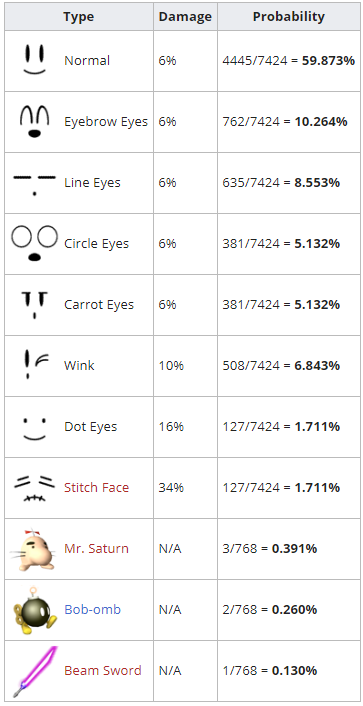

# PeachTurnipData

## What is this?
This repo includes scripts that utilize the [slippi-js](https://github.com/project-slippi/slippi-js) library to analyze [Project Slippi](https://github.com/project-slippi/project-slippi) replay files for Super Smash Brothers Melee to determine statistics related to Peach's Down Special - Turnip Pull.

In Super Smash Brothers Melee, when Peach uses her Down Special move, she will pull a turnip which she can then use in combat.  While most turnips are identical, there are certain turnips that are more powerful than normal.  Peach also has a small chance to pull a different item.  The probabilities for pulling each of these items is listed in the following chart:

This utility analyzes any number of .slp replay files and calculates statistics on the number and types of turnips pulled vs. each of the 26 characters in the game.

## How to use this

  1. Ensure you have [Node.js](https://nodejs.org/en/) and [Git](https://git-scm.com/downloads) installed on your computer
  2. Clone this project to your local machine
  
      `git clone https://github.com/Graffignaa/PeachTurnipData.git`
      
  3. Enter the newly created directory and install the necessary modules
      
      `cd PeachTurnipData`
      
      `npm install`
      
  4. Create a new subdirectory named "Slippi" and copy all of the .slp replay files you would like to analyze into this  directory.  Alternatively, you can move your existing Slippi directory (usually located at `C:/Users/<user account>/Documents/Slippi`) into the PeachTurnipData directory.
  
      `mkdir Slippi`
  
  5. Run the script and follow the on-screen instructions.
  
     `node peachTurnipData.js`
